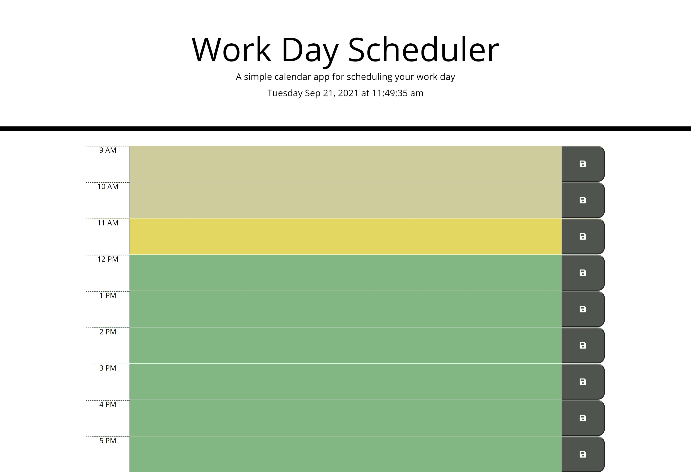
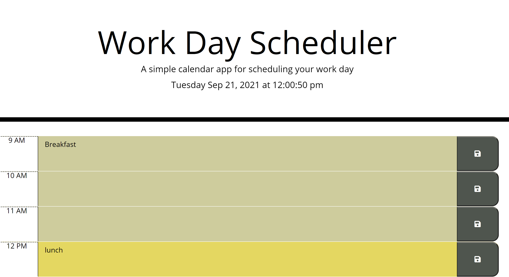
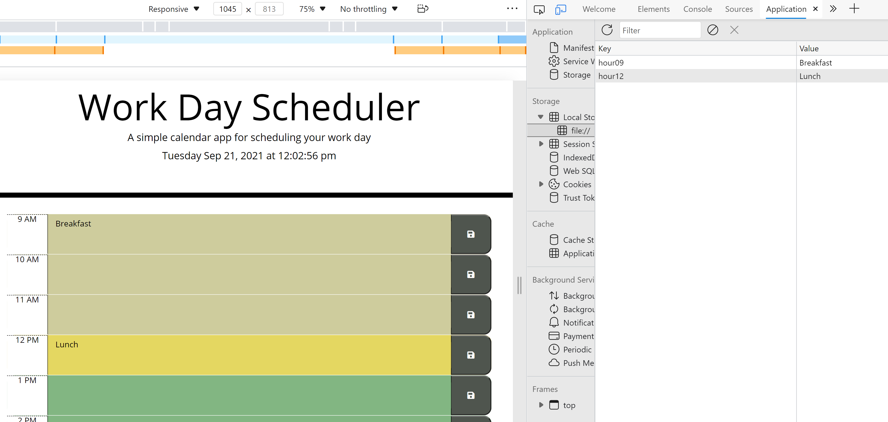

# [Work-Day-Scheduler](https://chaitra-srinivas.github.io/Work-Day-Scheduler/)
# Overview

This assignement involed creating a Work Day Scheduler which allows the user to save events into a planner for the duration of normal business hours. (9AM - 5PM). The events entered by the user are saved into the local storage and persist even when the page is refreshed.

The solution is developed using jQuery for functionality, Bootstrap for styling and Moment.js for date and time functionality. 

Screen shots:

